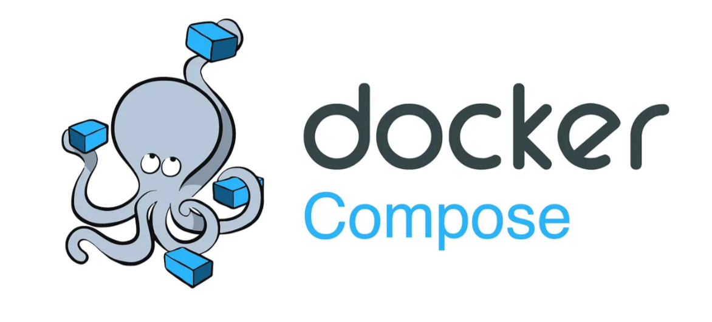
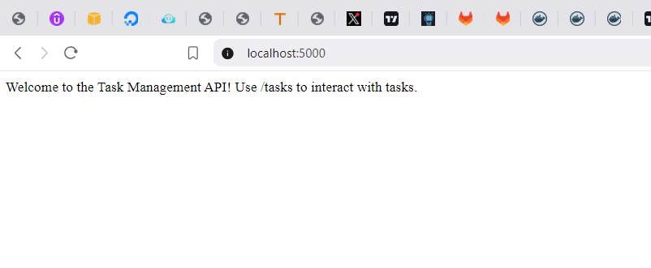
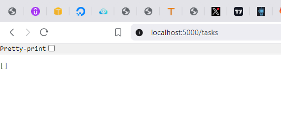
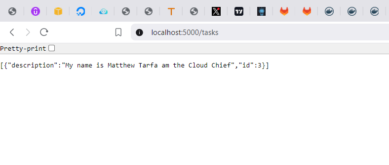
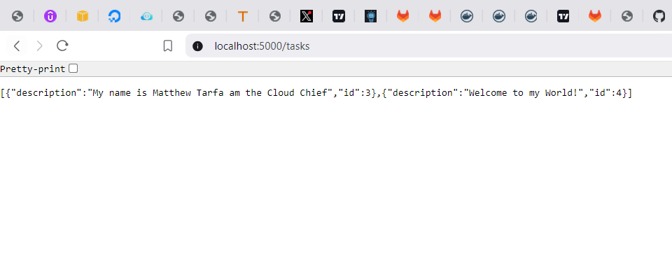
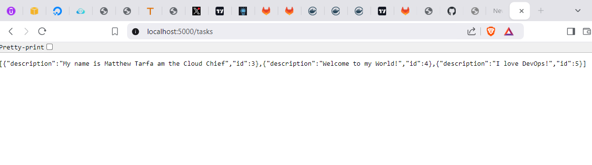
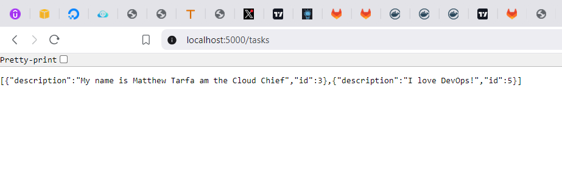

# Task Manager App with Flask and MySQL

## Project Overview

This project is a **Task Manager App** built with Flask and MySQL. It provides a simple RESTful API to manage tasks, demonstrating basic CRUD (Create, Read, Delete) operations. 

This application is perfect for understanding how Flask applications can be containerized using Docker and connected with a MySQL database.

## Features

* Add new tasks
* View all tasks
* Delete a task by ID


### Flask Code: ***app.py***

```<python>
from flask import Flask, request, jsonify
import mysql.connector
from mysql.connector import Error

app = Flask(__name__)

# Database connection function
def get_db_connection():
    try:
        connection = mysql.connector.connect(
            host="db",
            user="root",
            password="example",
            database="task_db"
        )
        return connection
    except Error as e:
        return str(e)

# Route for the home page
@app.route('/')
def home():
    return "Welcome to the Task Management API! Use /tasks to interact with tasks."

# Route to create a new task
@app.route('/tasks', methods=['POST'])
def add_task():
    task_description = request.json.get('description')
    if not task_description:
        return jsonify({"error": "Task description is required"}), 400

    connection = get_db_connection()
    if isinstance(connection, str):  # If connection fails
        return jsonify({"error": connection}), 500

    cursor = connection.cursor()
    cursor.execute("INSERT INTO tasks (description) VALUES (%s)", (task_description,))
    connection.commit()
    task_id = cursor.lastrowid
    cursor.close()
    connection.close()

    return jsonify({"message": "Task added successfully", "task_id": task_id}), 201

# Route to get all tasks
@app.route('/tasks', methods=['GET'])
def get_tasks():
    connection = get_db_connection()
    if isinstance(connection, str):  # If connection fails
        return jsonify({"error": connection}), 500

    cursor = connection.cursor()
    cursor.execute("SELECT id, description FROM tasks")
    tasks = cursor.fetchall()
    cursor.close()
    connection.close()

    task_list = [{"id": task[0], "description": task[1]} for task in tasks]
    return jsonify(task_list), 200

# Route to delete a task by ID
@app.route('/tasks/<int:task_id>', methods=['DELETE'])
def delete_task(task_id):
    connection = get_db_connection()
    if isinstance(connection, str):  # If connection fails
        return jsonify({"error": connection}), 500

    cursor = connection.cursor()
    cursor.execute("DELETE FROM tasks WHERE id = %s", (task_id,))
    connection.commit()
    cursor.close()
    connection.close()

    return jsonify({"message": "Task deleted successfully"}), 200

if __name__ == "__main__":
    app.run(host='0.0.0.0')


```
## MySQL Database Setup Script

Create a MySQL script named init-db.sql to set up the database and the tasks table:

To create the init-db.sql script, follow these steps:

Create a new **file** in your project directory:

Navigate to the project folder and create a new file named ***init-db.sql***
Add **SQL** commands to set up the database and tasks table:

Open ***init-db.sql*** in a text editor and add the following SQL commands:

```<sql>

CREATE DATABASE IF NOT EXISTS task_db;
USE task_db;

CREATE TABLE IF NOT EXISTS tasks (
    id INT AUTO_INCREMENT PRIMARY KEY,
    description VARCHAR(255) NOT NULL
);

```
### Save the file:

I saved the file as ***init-db.sql*** in the project folder  where my ***docker-compose.yml*** is located.

**In the docker-compose.yml:**

In my ***docker-compose.yml*** file, I have the volumes configuration that points to this script.

Below is the ***docker-compose.yml*** file


## Docker Configuration

***docker-compose.yml:***

```<>
version: '3'
services:
  db:
    image: mysql:5.7
    environment:
      MYSQL_ROOT_PASSWORD: example
      MYSQL_DATABASE: task_db
    ports:
      - "3306:3306"
    volumes:
      - db_data:/var/lib/mysql
      - ./init-db.sql:/docker-entrypoint-initdb.d/init-db.sql

  web:
    build: .
    ports:
      - "5000:5000"
    depends_on:
      - db
    environment:
      FLASK_ENV: development
    volumes:
      - .:/app

volumes:
  db_data:

```

This configuration ensures that when the MySQL container starts, it will execute the ***init-db.sql*** script to set up the ***task_db*** database and create the **tasks** table.

**Note:** The ***docker-entrypoint-initdb.d/*** directory is used by **MySQL** containers to execute ***.sql*** scripts during the initial startup of the container.

## Explanation:

**1. version: '3':** Specifies the version of Docker Compose being used.

**2. services:**
* db:

    * **image: mysql:5.7:** Uses the MySQL 5.7 image.
    * **environment:** Sets environment variables for the MySQL container:
       * **MYSQL_ROOT_PASSWORD:** The root password for MySQL.
       * **MYSQL_DATABASE:** The database to be created at startup.
    * **ports:** Maps the MySQL container's port 3306 to your host's port 3306.
    * **volumes:**
       * ***db_data:/var/lib/mysql:*** Persists the database data in a Docker volume called ***db_data.***
       * ***./init-db.sql:/docker-entrypoint-initdb.d/init-db.sql:*** Mounts the ***init-db.sql*** script into the **MYSQL** container's initialization directory so it runs when the container starts.
* **web:**

  * **build:** .: Builds the Docker image for your Flask app using the ***Dockerfile*** in the current directory.
  * **ports:** Maps the Flask app's port 5000 to your host's port 5000.
  * **depends_on:** Ensures that the ***db*** service starts before the web service.
  * **environment:** Sets the environment variable for Flask.
  * **volumes:** Mounts the current project directory into the ***/app*** directory inside the container.
### volumes section:
**db_data:** Defines a named volume db_data to persist the MySQL data between container restarts.


### Dockerfile:
Define the build instructions for the Flask app:

```
FROM python:3.9-slim

WORKDIR /app

# Install dependencies

COPY requirements.txt .
RUN pip install -r requirements.txt

# Install wait-for-it tool#

RUN apt-get update && apt-get install -y wait-for-it

#Copy the application code>

COPY . .

# Use wait-for-it to wait for DB and start the Flask app

CMD ["wait-for-it", "db:3306", "--", "python", "app.py"]

```

This Dockerfile sets up a lightweight Python environment for a Flask app:

**1. Base Image:** Uses python:3.9-slim for minimal Python runtime.
Working Directory: Sets /app as the working directory.

**2. Dependencies:** Copies requirements.txt and installs dependencies via pip.

**3. Tool Installation:** Installs wait-for-it for checking service readiness.

**4. Application Code:** Copies all app code into the container.

**5. Startup Command:** Runs wait-for-it to ensure the MySQL DB (db:3306) is ready before starting app.py.


### Requirements.txt File

This ***requirements.txt*** specifies that the Python project requires the **Flask framework** for building web applications and ***mysql-connector-python*** for connecting and interacting with a **MySQL database**. These packages will be installed within the **Docker** container when ***pip install -r requirements.txt*** is run during the image build process. This ensures the app has the necessary tools to run the **Flask server** and communicate with the **MySQL database**.

```<plaintext>
Flask
mysql-connector-python

```


After creating all the files the next step is to build and run the service the following command is used to build and run the  service.

```
docker-compose build
docker-compose up

```

to run the service in a detached mode I used the following command instead of ***docker-compose up***

```
docker-compose up -d
```

when I want to stop the service I use the command

``` 
docker-compose down
```

Now once the service is in the running state  run the command 

```
docker ps 
```
to ensure the containers are running 

Now its time to check the service API to ensure they are working as expected.

## Testing the Project
Access the app at http://localhost:5000/ .
 I was able to access the app on my browser after running the above command as seen in the image below.

 
 You can use Postman or curl to test the /tasks endpoint for POST, GET, and DELETE operations. In ths case I would be using curl.

### curl Commands:

* ***Get Tasks:***

The GET method fetches all tasks.
```
curl http://localhost:5000/tasks

```


Note that anytime you run http://localhost:5000/tasks on your browser it shows you all the task you have added as explained in the add task.

* ***Add a Task:***

The POST method creates tasks in the database.
```
curl -X POST http://localhost:5000/tasks -H "Content-Type: application/json" -d '{"description": "Sample Task"}'
```
This will send a POST request to your Flask app with a task description. If the task is added successfully, you should receive a response like:

```
{
    "message": "Task added successfully",
    "task_id": 1
}
```
check your browser's network tab or logs to verify that the POST request is being made correctly.

I ran the command a couple of times and customized the part where its says Simple Task to generate different outputs here are the commands I ran  and the out puts can be seen in the images below.

```
 curl -X POST http://localhost:5000/tasks -H "Content-Type: application/json" -d '{"description": "My name is Matthew Tarfa am the Cloud Chief"}'
 ```

```
 curl -X POST http://localhost:5000/tasks -H "Content-Type: application/json" -d '{"description": "Welcome to my World!"}'

```

```
 curl -X POST http://localhost:5000/tasks -H "Content-Type: application/json" -d '{"description": "I love DevOps!"}'
```



* ***Delete a Task:***


The DELETE method removes tasks by ID.

```
curl -X DELETE http://localhost:5000/tasks/1

```
I ran the below command to remove the task with the ID:4 as seen in the image below task 4 has been removed.

```
curl -X DELETE http://localhost:5000/tasks/4
```



## Conclusion

Creating a Task Manager App using Flask and MySQL is an excellent way to understand the fundamentals of web service development, database integration, and containerization with Docker. 

This project encapsulates how web servers and databases work in unison to provide seamless functionality. 

Embrace this learning experience and use it as a stepping stone to deeper web and cloud-based development projects.
